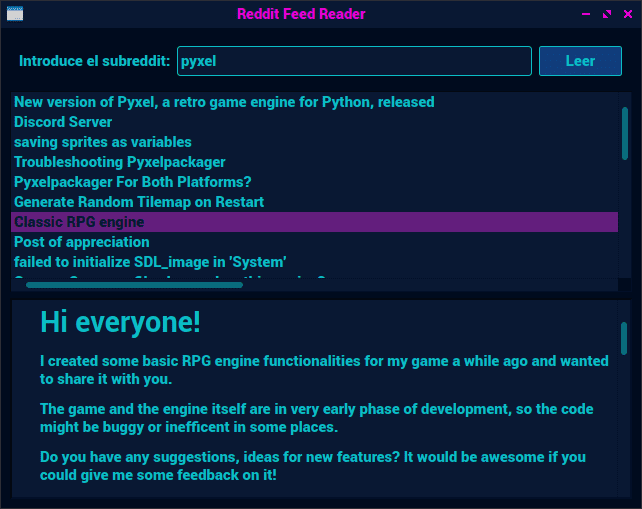

Si queremos desarrollar una aplicación con **Javascript** y **Node.js** y que esta tenga una interfaz gráfica hasta ahora la mejor solución pasaba por usar soluciones basadas en **Chromium**, como **Electron** y **NW.js**, pero estas soluciones son pesadas, tanto en espacio en disco (Electron pesa como mínimo **180MB**), como en consumo de CPU y RAM, si bien hay algunos casos donde ambos es menor (**VSCode**, por ejemplo, consume menos recursos que **Atom**, al menos hace como un año, cuando deje de usar el segundo).

Si bien ha habido varios intentos de sacar otros proyectos, como **libui-node**, (del que ya hable en este mismo blog, y el cual, a la hora de escribir este articulo lleva varios meses con poca actividad), para poder crear aplicaciones de manera nativa, desde hace unos meses tenemos una buena alternativa y que esta en continuo desarrollo y obteniendo una gran popularidad: **NodeGui**.

NodeGui se basa en el conocido framework **QT5**, el cual esta disponible para Windows, Linux (especialmente si usas los escritorios KDE y LXQT) y Mac, gracias al cual conseguimos aplicaciones que trabajan de manera nativa y con un consumo más eficiente de los recursos. Podemos dar estilos a través de **CSS** y tenemos 2 sabores: **nodegui**, si vamos a trabajar usando Javascript puro o Typescript, y **react-nodegui** si queremos mediante el framework **React**. Por otro lado NodeGui no usa, estrictamente hablando, Node.js, sino un fork propio del proyecto, [Qode](https://github.com/nodegui/qode), con ligeras modificaciones, como el poder usar bucles de eventos, el cual se instala como un modulo de Node más, por lo que no es obligatorio instalarlo por separado.

Ademas también tienen otro proyecto, [packer](https://github.com/nodegui/packer), mediante el cual podemos empaquetar fácilmente nuestros programas y distribuirlos para Windows, GNU/Linux (en formato AppImage) y Mac.

Como el movimiento se muestra andando vamos a ir creando un programa sencillo, con el cual vamos a mostrar las ultimas entradas de un subreddit, el cual introducirá el usuario en un campo.

Al final obtendremos algo como esto:



Lo primero, y antes de todo, vamos a instalar tanto Node como npm, su gestor de paquetes. Si usas **GNU/Linux** esto es tan fácil como instalarlo desde los repositorios. Ademas también necesitaremos tener instalado GCC, Cmake y make, necesarios para compilar NodeGui.

* Debian, Ubuntu y derivadas: `apt-get install pkg-config build-essential cmake node npm`
* Arch Linux y derivadas: `pacman -S gcc make cmake node npm`

Para **Windows** y **Mac** tenéis las instrucciones en [la página de documentación de NodeGUI](https://docs.nodegui.org/docs/guides/getting-started/#developer-environment). 

> **Nota:** Es necesario que la versión que tengamos instalada de Node sea de la misma versión mayor que Qode ya que de lo contrario nos encontraremos con módulos incompatibles, como el propio NodeGui. Qode, en su versión 2, se basa en Node 13.x.	

### Empezando a crear nuestra aplicación:

NodeGui tiene dos repositorios con los cuales podemos empezar a crear nuestros proyectos, pero en este caso vamos a ir creando uno desde cero, así de paso mostrare como iniciar un proyecto de Node.js para aquell@s que van a empezar. Abre una terminal y muévete hasta la carpeta donde se guardara el proyecto. Una vez en ella vamos a iniciar el proyecto. Para ello escribe lo siguiente en la terminal:

```bash
git init
```


Nos ira preguntando varias cosas:

* package name: el nombre del paquete. Solo puede contener letras minúsculas, números, puntos, guiones y subrayados.
* version: la versión del paquete. Por defecto es 1.0.0. Déjalo así o pon otro. Por ejemplo yo empiezo siempre con 0.1.0 o 0.0.1
* descripcion: Una breve descripción del paquete.
* entry point: Este paso es importante. Con el se indica cual sera el fichero inicial, o sea, el que se leerá en cuanto se vaya a ejecutar. En este caso vamos a poner src/index.js para así tenerlo un poco organizado.
* test command: Este es el comando que se ejecutara para hacer pruebas del paquete con el comando `npm test`. En este caso vamos a poner `qode src/index.js`
* git repository: la url al repositorio git del proyecto. Lo dejamos en blanco por el momento.
* keywords: las palabras clave de nuestro paquete. Esto por el momento lo vamos a dejar en blanco. Esto sirve para cuando lo vayamos a subir a [npmjs](https://www.npmjs.com/), el principal repositorio de paquetes para node.js.
* author: El nombre del autor, en este caso, el tuyo.
* license: La licencia del paquete. Por defecto es [ISC](https://opensource.org/licenses/ISC). Vamos a dejarlo tal cual de momento.

Y ahora nos mostrara los datos introducidos, si esta todo correcto pulsamos Enter y ya tenemos el proyecto listo.

#### Instalación de los paquetes necesarios:

Para seguir con esta introducción vamos a necesitar instalar 2 paquetes: el de nodegui y [rss-parser](https://github.com/rbren/rss-parser), siendo este el que usaremos para comunicarnos obtener las entradas. Para ello en la terminal y estando el la carpeta del proyecto ejecutamos lo siguiente para instalar los paquetes necesarios:

```bash
export QT_INSTALL_DIR=/usr/lib/qt/
npm i @nodegui/nodegui rss-parser
```


> La primera linea es necesaria si tienes instalado Qt en tu sistema, sobre todo si usas LXQT o KDE, ya que de lo contrario bajara una versión mínima de QT y, por ejemplo, la aplicación no cogerán el tema que estés usando.

> También es posible usar la versión de desarrollo, ideal si quieres ir probando novedades antes del lanzamiento de nuevas estables mediante el comando `npm i http://master-release.nodegui.org`

#### Empezando a escribir nuestra aplicación

Lo primero es crear el fichero principal, para ello dentro de la carpeta del proyecto creamos el directorio */src* y en el creamos el fichero *index.js*, tal y como indicamos a la hora de crear el proyecto. Si pusiste otro nombre y/o ruta simplemente créalos con esos nombres.

Abrimos el fichero y o primero que vamos a hacer es importar los módulos necesarios para este tutorial (los cuales iré explicando según los vayamos usando), ademas de crear un array donde iremos almacenando el contenido de cada entrada obtenida:

```js
const {
  QMainWindow,
  QWidget,
  QLabel,
  QPushButton,
  QListWidget,
  QListWidgetItem,
  QBoxLayout,
  QLineEdit,
  QScrollArea,
  QTextBrowser,
  QMessageBox,
  ButtonRole
} = require('@nodegui/nodegui');
const axios = require('axios');
const Parser = require('rss-parser');
const parser = new Parser();
let feeds = []; // En este array iremos guardando las entradas obtenidas
```

Vamos a crear la parte más básica del proyecto, la ventana principal:

```js
const win = new QMainWindow();
win.setMinimumSize(640, 480);
win.setWindowTitle("Reddit Feed Reader");
```

**QMainWindow** es la clase para crear la ventana principal del programa. Con la primera linea creamos una nueva instancia de la clase, con la segunda indicamos cual es su tamaño mínimo y con la tercera indicamos cual sera el titulo de dicha ventana.

```js
const centralWidget = new QWidget();
const rootLayout = new QBoxLayout(2);
centralWidget.setLayout(rootLayout);
win.setCentralWidget(centralWidget);
```

La primera linea crea una nueva instancia de la clase **QWidget**, que es la de los widgets. Un widget es un objeto que representa a cada elemento que vayamos añadiendo. Una lista, un campo de texto, o un menú, son clases derivadas de QWidget. Piensa en ellos como elementos HTML.

La segunda crea una nueva instancia de uno de los tipos de diseño disponibles, en este caso una caja (como un &lt;div> HTML por ejemplo). Los otros son la flexible (FlexBox) y la cuadricula (QGridLayout). Son en estos en donde se irán añadiendo el resto de elementos. El **2** indica que los elementos se irán colocando desde arriba hacía abajo.

Con la siguiente indicamos que el diseño del widget central sera el que hemos puesto en la linea anterior y con la siguiente establecemos el widget central como tal.

Ahora vamos a ir añadiendo los elementos. Vamos con el primero:

```js
const hbox1 = new QWidget();
const hbox1_layout = new QBoxLayout(0);
hbox1.setLayout(hbox1_layout);
rootLayout.addWidget(hbox1);
```

Hemos creado un nuevo widget con otro diseño de caja, pero esta vez los elementos irán de izquierda a la derecha. En esta es donde iremos añadiendo un etiqueta, el campo para introducir un texto y un botón:

```js
const label1 = new QLabel();
label1.setText('Introduce el subreddit:');
hbox1_layout.addWidget(label1);

const subreddit = new QLineEdit();
hbox1_layout.addWidget(subreddit);

const btn_leer = new QPushButton();
btn_leer.setText('Leer');
hbox1_layout.addWidget(btn_leer);
```

**QLabel** es la clase para añadir etiquetas. En la siguiente linea insertamos el texto, pero a un label podemos añadir algunas etiquetas HTML 4 y/o imágenes. La tercera es la que añade este elemento a la caja horizontal.

**QLineEdit** es la clase para añadir un campo donde el usuario puede introducir texto, el equivalente a &lt;input type="text" /> de HTML.

y **QPushButton** es la clase para añadir un botón. Más adelante veremos que como añadir que haga algo cuando se pulse en el.

Ahora vamos a añadir el widget para las listas:

```js
const lista_feeds = new QListWidget();
rootLayout.addWidget(lista_feeds);
```

Más adelante veremos como añadir elementos a esta lista, que sera en cuando obtengamos las entradas desde Reddit.

Y ahora vamos a añadir el widget donde se mostrara el contenido de la entrada que seleccionemos en el listado:

```js
const scrollArea = new QScrollArea();
rootLayout.addWidget(scrollArea);

const leer = new QTextBrowser();
leer.setOpenExternalLinks(true);
scrollArea.setWidget(leer);
```

Lo primero que vemos es que creamos una nueva estancia de **QScrollArea**, el cual añade un área donde se mostrara las barras de desplazamiento en el caso de que el widget ocupe más espacio del que queremos.

**QTextBrowser** es la clase para añadir un navegador de texto, en cierto modo es como un QLabel, solo que este admite más etiquetas HTML, si bien quiero poner énfasis en esto, y es que no cargara imágenes externas, por lo que, incluso en este caso, veremos un icono donde debería de haber una imagen. Podría haber implementado algo, pero se aleja de hacer una aplicación sencilla para este tutorial.

```js
const messageBox = new QMessageBox();
messageBox.setWindowTitle('¡Error!');
messageBox.setModal(true);
const accept = new QPushButton();
accept.setText('Aceptar');
messageBox.addButton(accept, ButtonRole.AcceptRole);
```

**QMessageBox** es la clase que nos permite mostrar un dialogo, pero hay otros diálogos que podemos usar en nuestra aplicaciones.

Con la tercera linea indicamos que el dialogo es un modal y con las siguientes añadimos un botón, el cual ademas tendrá asignado un rol, que es el de Aceptar. En este ejemplo solo nos sirve para que al pulsarlo se cierre.

Y vamos a mostrar la ventana de nuestra aplicación:

```js
win.show();
global.win = win;
```

La ultima linea, es según la documentación, para que no vaya acumulando basura cuando se cierre la aplicación.

Si ahora ejecutamos el programa con `npm test` nos mostrara la ventana, pero aun falta implementar las funciones que se encargaran de obtener las entradas y mostrarlas. Vamos con lo primero, que es obtener las entradas. En el código he puesto comentarios para que sea más fácil de leer.

```js
const obtener_entradas = (async () => {
  feeds = []; // Vaciamos el array que contiene las entradas.
  sr = subreddit.text(); // Obtenemos el subreddit que se escribió en el campo.
  sr = sr.trim(); // Eliminamos cualquier espacio antes y después del texto
  if (!sr) return; // Si el texto esta vario, simplemente se sale de la función.
  try {
    let feed = await parser.parseURL(`https://www.reddit.com/r/${sr}/.rss`);
    if (feed.items.length > 0) {
      feed.items.forEach(item => {
        l_item = new QListWidgetItem();
        l_item.setText(item.title);
        lista_feeds.addItem(l_item);
        feeds.push(item.content);
      });
    } else {
      messageBox.setText('El subreddit no existe o no hay entradas.');
      messageBox.exec();
    }
  } catch (error) {
    messageBox.setText('Ocurrió un error al obtener el feed.');
    messageBox.exec();
  }
});
```

Lo más destacado sea que esta es una función asíncrona, lo que evita que el programa se quede congelado y la sensación de que esta fallando.

Ahora vamos a conectar esta función con el botón Leer:

```js
btn_leer.addEventListener('clicked', obtener_entradas);
```

Como vemos estamos usando el mismo método que cuando lo usamos en un sitio web.

Y ya vamos a finalizar con la que ira mostrando el contenido de la entrada:

```js
lista_feeds.addEventListener('currentItemChanged', () => {
  leer.clear();
  row = lista_feeds.currentRow();
  leer.insertHtml(feeds[row]);
});
```

Primero limpiamos el widget donde se mostrara el contenido, con el segundo obtenemos el indice seleccionado y ya con la siguiente lo insertamos.

Y esto es todo el código, ahora vuelve a ejecutar el programa y probar a obtener los feeds.

Este ejemplo es algo sencillo, pero te puede valer para ir experimentado, por ejemplo, que guarde un listado de subreddits e ir seleccionado el que quieres leer, que vaya guardando las entradas como si fuese un lector de feeds, etc.

Y esto es todo por el momento. Espero que os haya gustado y sido de utilidad. Espero en un futuro escribir algún tutorial más de NodeGUI ya que me parece la mar de útil.

Podéis encontrar el código del ejemplo [en este repositorio](https://github.com/son-link/nodegui-tuto-reddit-feed)

Nos leemos.